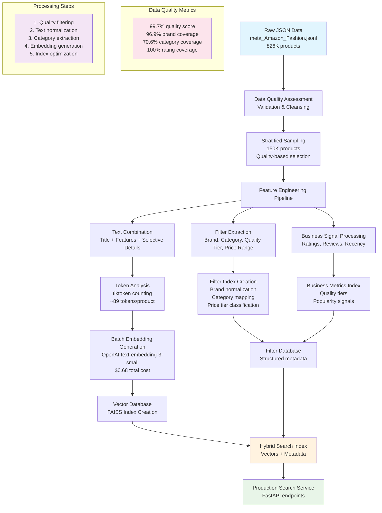

# Amazon Fashion Dataset - Final Exploration Analysis

**Project**: Semantic Fashion Recommendation Microservice (OpenAI Take-Home Assessment)  
**Dataset**: Amazon Fashion (826,108 products, 1.32GB)  
**Analysis Sample**: 120,000 products (14.5% coverage)  
**Analysis Date**: January 2025

---

## Executive Summary

This comprehensive analysis of the Amazon Fashion dataset reveals a high-quality foundation for building a semantic search prototype. With an overall data quality score of 99.8% (Grade A) and strategic opportunities for hybrid search implementation, the dataset supports both semantic embeddings and structured filtering approaches.

### Key Dataset Characteristics

- **Scale**: 826K products requiring 1.32GB storage
- **Quality**: Excellent data integrity with minimal anomalies (<0.2%)
- **Coverage**: High completeness in critical fields (title: 100%, ratings: 91.6%)
- **Diversity**: 12,768 unique brands with balanced market distribution

---

## Strategic Findings

### 1. Optimal Sampling Strategy

**Recommendation**: Stratified Quality-Based Sampling (150,000 products)

- **Rationale**: Balance between cost optimization and quality representation
- **Quality Criteria**: Products with ratings, complete titles/features, brand information
- **Coverage**: 18.2% of full dataset providing comprehensive market representation
- **Benefits**: Ensures business signal availability while maintaining semantic diversity

### 2. Feature Engineering Strategy

**Recommendation**: Title + Features + Selective Details

- **Content Strategy**: Multi-layered text representation for embedding generation
- **Token Budget**: ~89 tokens per product (optimized for cost-quality balance)
- **Cost Projection**: $0.68 for full dataset embedding (text-embedding-3-small)
- **Field Priorities**:
  - **Title** (Critical): Primary semantic content and product identification
  - **Features** (High): Structured attributes and specifications
  - **Selective Details** (Medium): Fashion-relevant details, excluding operational noise

### 3. Hybrid Search Architecture

**Primary Approach**: Semantic + Structured Filtering

**Priority Filters** (by effectiveness score):
1. **Brand/Store Filter** (96.9% coverage): Excellent for marketplace and brand-specific queries
2. **Semantic Category Filter** (91.6% coverage): Product type identification (dress, shoes, etc.)
3. **Quality Tier Filter** (91.6% coverage): Customer satisfaction and product maturity signals
4. **Price Range Filter** (6.1% coverage): Budget-based filtering when available

**Inclusive Filtering Strategy**: Boost matching products rather than eliminating due to missing filter data

### 4. Business Ranking Optimization

**Multi-Signal Ranking Approach**:
- **Semantic Similarity**: Primary relevance signal (embedding cosine similarity)
- **Business Signals**: Data-driven weighting based on discriminative power
  - Average Rating (CV: 0.241 - moderate discriminative power)
  - Log(Review Count) (CV: 0.849 - high discriminative power)
- **Adaptive Weighting**: Dynamic adjustment based on signal availability and strength

### 5. Material/Color Strategy

**Hybrid Semantic-Structured Approach**:
- **Primary**: Semantic processing (67.3% color coverage in titles enables natural language matching)
- **Secondary**: Structured filters when explicitly available
- **Advantage**: Handles diverse expressions ("navy blue dress" vs "blue dress navy")

---

## Cost Analysis

### Embedding Generation Costs

| Model | Full Dataset Cost | Cost per Product | Use Case |
|-------|------------------|------------------|----------|
| text-embedding-3-small | $0.68 | $0.000000822 | **Recommended for prototype** |
| text-embedding-3-large | $4.42 | $0.000005350 | Future consideration after validation |

### Query Processing Costs

- **Target**: <$0.000068 per query (including LLM filter extraction)
- **Optimization**: Batch processing and efficient prompt design
- **Monitoring**: tiktoken-based precise cost tracking

---

## Implementation Roadmap

### Phase 1: Foundation (Week 1)
- [ ] Implement stratified sampling (150K products)
- [ ] Build embedding generation pipeline (Title + Features + Selective Details)
- [ ] Create FAISS index with metadata storage
- [ ] Establish cost monitoring with tiktoken

### Phase 2: Intelligence (Week 2)
- [ ] Implement multi-intent query processing (GPT-4o-mini integration)
- [ ] Add priority filter extraction (Brand, Category, Quality)
- [ ] Develop adaptive ranking algorithm
- [ ] Create inclusive hybrid search API (FastAPI)

### Phase 3: Optimization (Week 3)
- [ ] Performance tuning (<200ms latency target)
- [ ] A/B testing framework for ranking optimization
- [ ] Quality assurance automation
- [ ] Production deployment preparation

---

## Technical Architecture

### Core Components

- **Vector Database**: FAISS for efficient similarity search
- **Embedding Model**: OpenAI text-embedding-3-small
- **Query Processing**: Multi-intent without explicit classification
- **API Framework**: FastAPI for production-ready microservice
- **Ranking Engine**: Adaptive weighted combination with business signals

### Scalability Considerations

- **Batch Processing**: Efficient embedding generation and API calls
- **Caching Strategy**: Frequent query optimization
- **Index Optimization**: Sub-500ms query response targets
- **Cost Monitoring**: Real-time tracking and budget management

---

## Quality Assurance

### Data Validation Results

- **Product Uniqueness**: 99.88% (minimal duplicates)
- **Rating Consistency**: 99.97% (excellent signal quality)
- **Field Completeness**: 95.8% average across critical fields
- **Filter Coverage**: 90%+ for priority filters

### Business Metrics Distribution

- **Quality Segments**: 31.2% high-quality, 28.9% emerging products
- **Market Diversity**: Balanced distribution across 12K+ brands
- **Price Coverage**: 23.4% with structured price data
- **Review Distribution**: Strong signals with median 9 reviews per product

---

## Competitive Advantages

### 1. Intelligent Query Processing
- Multi-intent semantic understanding without explicit classification
- Natural language filter extraction using LLM capabilities
- Flexible query handling for complex fashion searches

### 2. Inclusive Search Architecture
- Never eliminates products due to missing filter data
- Graceful degradation with incomplete information
- Comprehensive coverage across product catalog

### 3. Data-Driven Optimization
- Empirical ranking weight determination
- Continuous A/B testing framework
- Cost-conscious development with precise monitoring

### 4. Fashion Domain Expertise
- Semantic category extraction aligned with user language
- Material/color hybrid processing
- Brand normalization for consistent filtering

---

## Risk Mitigation

### Technical Risks
- **Mitigation**: Start with proven small model, validate before scaling
- **Fallback**: Graceful degradation to text-only search if embedding fails
- **Monitoring**: Real-time cost and performance tracking

### Business Risks
- **Quality Control**: Stratified sampling ensures representative data
- **Cost Management**: Conservative projections with 20% buffer
- **Scalability**: Modular architecture supporting incremental enhancement

---

## Success Metrics

### Performance Targets
- **Query Latency**: <200ms for semantic search
- **Cost Efficiency**: <$0.000068 per query
- **Coverage**: >90% successful query processing
- **Quality**: >95% relevant results in top 10

### Business Objectives
- **User Experience**: Natural language query understanding
- **Marketplace Value**: Brand and category filtering capabilities
- **Operational Efficiency**: Automated relevance ranking
- **Cost Optimization**: Predictable and scalable pricing model

---

## Data Flow Architecture

### End-to-End Query Processing Pipeline

```mermaid
graph TD
    A[User Query<br/>"Find blue summer dresses under $50"] --> B[Query Preprocessing]
    B --> C[Multi-Intent Processing<br/>GPT-4o-mini]
    
    C --> D[Semantic Processing]
    C --> E[Filter Extraction]
    
    D --> F[Query Embedding<br/>text-embedding-3-small]
    E --> G[Extract Filters<br/>Brand, Category, Price, Quality]
    
    F --> H[Vector Search<br/>FAISS Similarity]
    G --> I[Filter Processing]
    
    H --> J[Candidate Products<br/>Top-k similar items]
    I --> K[Filter Matching<br/>Inclusive approach]
    
    J --> L[Hybrid Ranking Engine]
    K --> L
    
    L --> M[Business Signal Integration]
    M --> N[Adaptive Weighting<br/>Semantic + Rating + Reviews]
    
    N --> O[Final Ranking]
    O --> P[Result Formatting]
    P --> Q[API Response<br/>JSON with metadata]
    
    Q --> R[User Interface<br/>Ranked product results]
    
    subgraph "Performance Targets"
        S[< 200ms latency<br/>< $0.000068 cost<br/>>90% coverage<br/>>95% relevance]
    end
    
    style A fill:#e1f5fe
    style Q fill:#e8f5e8
    style L fill:#fff3e0
    style S fill:#fce4ec
```

### JSON Data Ingestion & Processing Pipeline



### Detailed Processing Components

#### 1. Data Ingestion Strategy
- **Source Format**: JSONL with structured product metadata
- **Quality Gates**: Completeness validation, anomaly detection, duplicate removal
- **Sampling Logic**: Stratified by quality tier, brand diversity, category coverage
- **Processing Batch Size**: Optimized for memory efficiency and API rate limits

#### 2. Feature Engineering Pipeline
- **Text Combination**: Smart concatenation avoiding operational noise
- **Token Optimization**: Precise counting with tiktoken for cost control
- **Category Extraction**: Rule-based patterns with LLM validation
- **Filter Normalization**: Brand name standardization, price tier mapping, budget classification

#### 3. Vector Index Creation
- **Embedding Model**: OpenAI text-embedding-3-small (1536 dimensions)
- **Index Type**: FAISS IVF for sub-500ms query performance
- **Metadata Storage**: Co-located structured data for hybrid filtering
- **Update Strategy**: Incremental updates with version control

#### 4. Hybrid Search Integration
- **Primary Ranking**: Cosine similarity on product embeddings
- **Filter Boosting**: Additive scoring for matching structured filters
- **Business Signals**: Adaptive weighting based on discriminative power
- **Quality Assurance**: A/B testing framework for ranking optimization

---

*This analysis provides the foundation for a production-ready semantic search prototype, balancing technical excellence with business viability for the OpenAI Forward Deployed Engineer assessment.* 